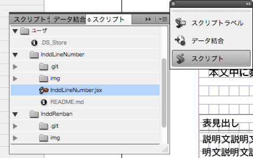

InddLineNumber
==========

Auto Numbering for InDesign CS4+

#About
表に連番を挿入します。ソースコードに行番号を付けるために作成しました。
初期値とゼロパディングの形式を選択できます。

カーソルのあるセルから下方向に振っていくので、途中から番号を変えることもできます。

#Install
InDesign CS4以降のScripts PanelフォルダにinddLineNumber.jsxを保存します。

※「Scripts Panel」フォルダはInDesignの〈Script〉パネルで「Users」を右クリック→［Finder］で表示できます。

〈Script〉パネルは［ウィンドウ］→［自動化］→［スクリプト］パネルを選択して表示します。

#How to Use
- 表の連番を降り始めたいセルにカーソルを置きます。
- 〈Script〉パネルから「InddLineNumber.jsx」をダブルクリックします
- ダイアログボックスが表示されるので、初期値とゼロパディングの形式を選択し、〈OK〉ボタンをクリックします。
